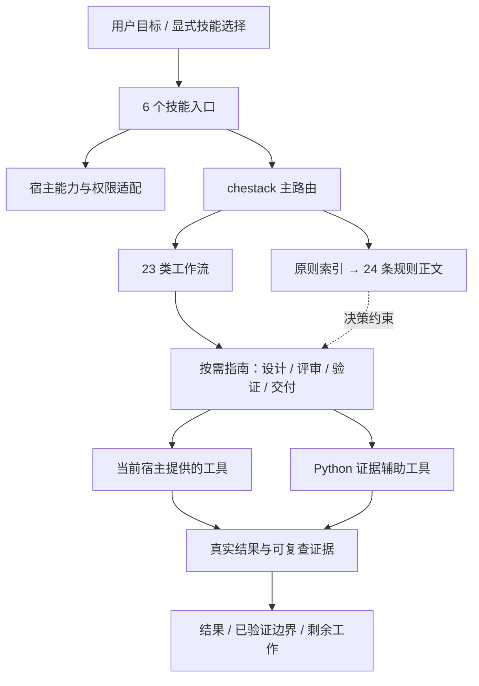

# chestack

面向 **Codex / ChatGPT** 的工程工作流插件，由 [superche](https://github.com/superche) 维护。参考 pstack 的原则、工作流和验证结构，重新设计宿主适配、加载方式与交付边界。

**当前版本：0.1.0，私有仓库内部迭代。** 包含 6 个技能入口、24 条按需读取的原则、23 类工作流，以及 Python 标准库实现的辅助工具。默认继承当前会话模型；不依赖 Cursor、Claude Code 或 Grok。

## 开始使用

已安装插件时，在 Codex 中显式选择技能：

```text
$chestack 找出这个缺陷的根因，修复并验证实际行为。
$chestack 先给出重构计划，不修改代码。
$chestack-review 检查这次变更及其对调用方的影响。
$chestack-verify 验证这个改动在真实应用中是否生效。
```

在支持插件的 ChatGPT 环境中，通过插件或技能选择器选中 Chestack。执行能力取决于当前会话实际提供的终端、连接器、浏览器及代理工具。缺少能力时，工作流会给出可审阅结果并明确未验证部分。

| 入口 | 职责 |
|---|---|
| `chestack` | 主路由：理解目标、选择工作流、加载原则、执行和验证 |
| `chestack-setup` | 检查环境能力，解释配置和使用方式 |
| `chestack-explain` | 解释 how / why、教学和恢复上下文 |
| `chestack-review` | 正确性、影响范围、类型和注释评审 |
| `chestack-verify` | 真实行为验证、生成或维护验证方法 |
| `chestack-reflect` | 将重复纠正转为结构或可验证规则 |

这些入口默认显式调用。原则是普通 Markdown 参考文件，由入口按路径读取，不向技能列表注入 24 个独立入口。需要点名时可以说：`$chestack 应用 prove-it-works，展示实际结果。`

## 安装

### Codex 插件 / marketplace

先以有权限的 GitHub 身份访问私有仓库。使用支持插件命令的 Codex CLI：

```sh
codex plugin marketplace add superche/chestack --ref main
codex plugin add chestack@superche-chestack
```

第二条命令已在本地 Codex CLI 0.142.5 中确认存在；不同客户端版本的安装界面可能不同。桌面端也可从已添加的 marketplace 中安装。必要时新开会话或刷新技能列表。

### 本地技能安装

当宿主支持本地技能发现但不支持 marketplace 时：

```sh
gh repo clone superche/chestack
cd chestack
python3 scripts/install_skills.py --dest /absolute/path/to/project/.agents/skills
```

个人安装可将 `--dest` 指向 `~/.agents/skills`。安装器复制全部 6 个技能，保持相互引用完整；发现同名技能时整体停止并保留现有文件。初版不提供覆盖更新或自动卸载，以免破坏本地修改。插件安装和本地复制二选一，避免同名技能重复出现。

### ChatGPT

插件采用 OpenAI 支持的根目录 `plugin.json` 格式。支持自定义 marketplace 的桌面环境可按上面的仓库方式加载；其他 ChatGPT 表面的分发、组织政策和权限需要通过其实际插件入口验证。仅有 GitHub 仓库不会自动让所有 ChatGPT 客户端获得插件。本版本不宣称已完成跨端上线验收。

## 架构



路由是模型遵循的工作流指令。可执行工具只处理确定性的辅助工作，不构成自治运行时。

## 验证和开发

Python 3.10+，运行时和测试均不需要第三方 Python 包：

```sh
python3 scripts/validate.py
python3 -m unittest discover -s tests -v
python3 skills/chestack/scripts/chestack.py doctor
```

工具包括 `doctor`、`plan-check`、`log`、`pr-status`。`pr-status` 需要已登录的 `gh`，只读取 PR 概况，不轮询、不合并、不将未知状态判定为 merge-ready。

查看 [架构和宿主边界](docs/architecture.md)、[pstack 模块对应表](docs/pstack-mapping.md)、[验证记录](docs/validation.md)、[贡献约定](CONTRIBUTING.md) 和 [上游来源](NOTICE.md)。

## 当前边界

- 未安装独立的后台服务、事件监听器或模型运行时。
- 调度、子代理、浏览器和连接器依赖宿主实际暴露的能力；不支持时明确降级。
- Benny 风格的外部 issue 自动化和 UI webhook 目前是设计指南，尚无执行服务。
- 初版不移植上游 Bun orchestration store 或 PR watcher；使用任务内记录、只读快照和按需原生调度。
- 本地通过、CI 通过、评审、合并、部署和真实客户端验收分别报告。

## License

MIT。包含对 pstack 设计和规则的改写，保留 [原始 MIT 声明](licenses/pstack-MIT.txt)。私有仓库可见性与许可证相互独立。
