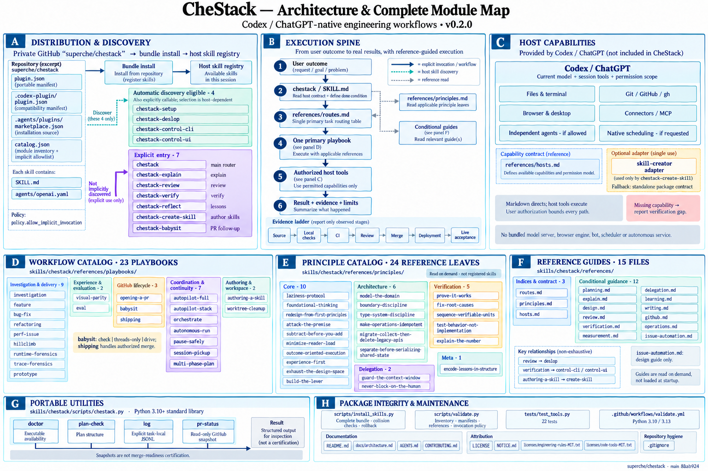

# CheStack 架构

CheStack 将任务入口、执行步骤、决策规则和宿主能力分开组织。入口提供用户可选择的能力，按需引用提供具体约束，当前宿主完成实际操作。

| 层 | 内容 | 职责 |
|---|---|---|
| 分发 | [plugin.json](../plugin.json)、[marketplace](../.agents/plugins/marketplace.json) | 插件身份、展示信息与安装来源 |
| 入口 | [skills](../skills) | 11 个技能入口，4 个支持隐式调用 |
| 路由 | [routes.md](../skills/chestack/references/routes.md) | 将目标匹配到 23 类工作流 |
| 原则 | [principles.md](../skills/chestack/references/principles.md) | 24 条按需读取的决策约束 |
| 宿主 | [hosts.md](../skills/chestack/references/hosts.md) | 能力发现、模型继承、权限和缺失能力处理 |
| 工具 | [chestack.py](../skills/chestack/scripts/chestack.py) | 环境检查、计划结构校验、日志和 PR 快照 |

## 完整模块图

点击图片查看原图。

## 技能发现与按需加载

`agents/openai.yaml` 中的 `policy.allow_implicit_invocation` 控制隐式选择。setup、deslop、control-cli、control-ui 设置为 `true`；主入口与其他工作流设置为 `false`。开启后由宿主根据技能描述判断相关性，不保证每次匹配。`catalog.json` 的 `implicit_skills` 记录允许自动选择的集合，校验器检查配置是否一致。入口已被选择后，引用文件由明确路径加载；原则本身无需注册为技能。仓库内的相对引用必须随完整技能包一起安装。

## 专用能力

- **Deslop：**检查当前变更新增的复杂性，用周边代码和实际契约判断可删除内容，并验证行为保持。
- **Control CLI：**绑定真实进程或 PTY，按提示状态逐步输入，检查输出与退出状态，清理自建会话。
- **Control UI：**绑定正确应用和页面，基于新鲜快照定位目标，逐步验证交互，保留匹配状态的视觉证据。
- **Create Skill：**使用宿主可用的技能创建指导，或直接按包契约生成和校验文件；不依赖特定内置命令。
- **Babysit：**提供 check、threads-only 和 drive 模式；读取当前 PR 状态并处理授权范围内的阻塞；合并使用独立的 shipping 工作流。

## 状态与结果

代码执行依赖当前工具能力，不由 Markdown 自行提供。没有终端时可交付补丁但不能声称已执行；没有界面控制时保留 UI 验收缺口；没有调度工具时不能承诺未来运行。

`pr-status` 提供只读观察。完整就绪判断还需核对评审线程、保护规则、依赖和当前 head。决策记录用于长任务恢复，不会自动创建调度或启动代理。

结果报告说明已完成的行为、支持结论的证据和未覆盖边界。实施历史与一次性操作流水不属于产品文档。
